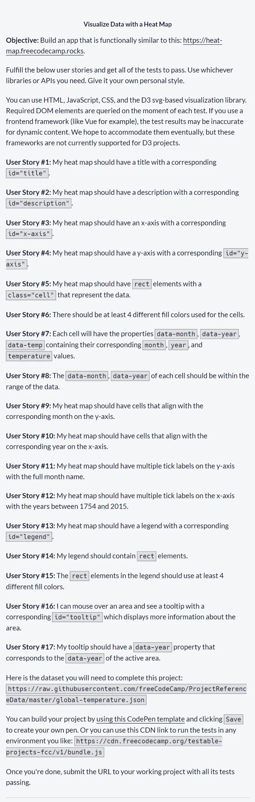
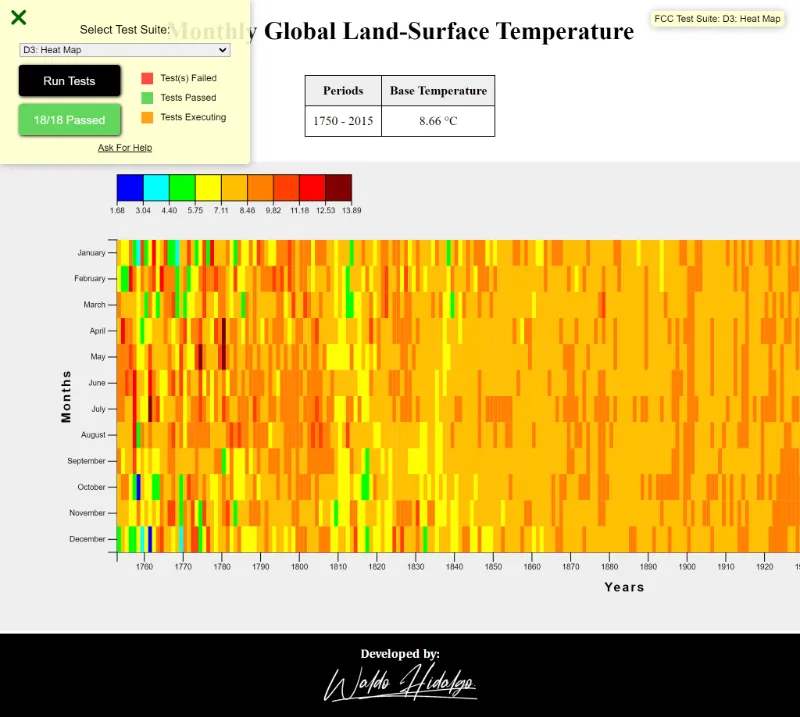
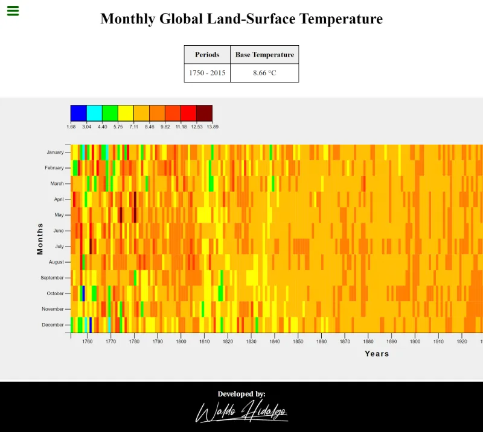
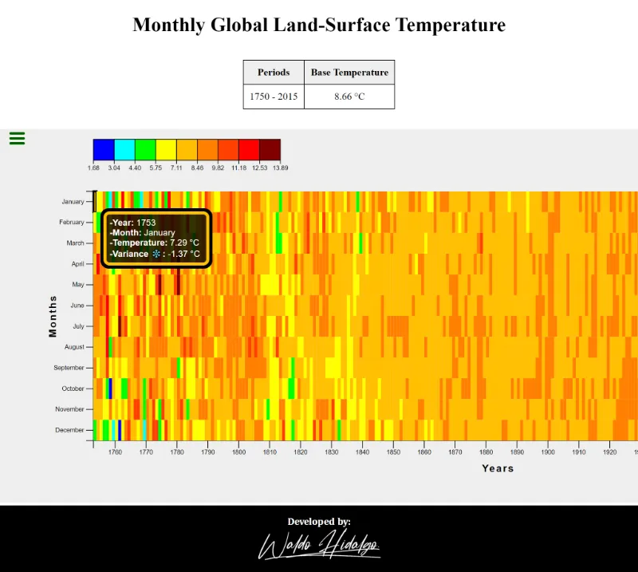
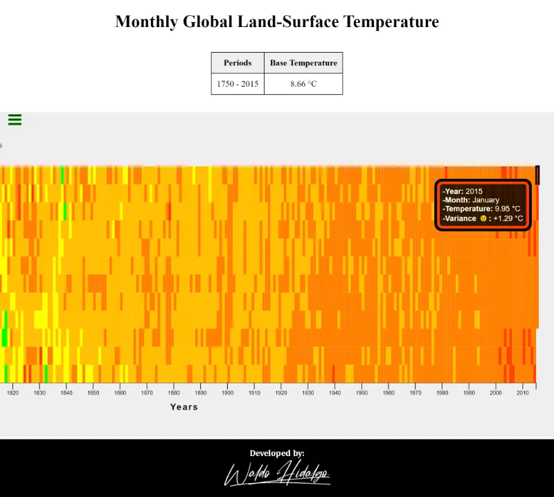
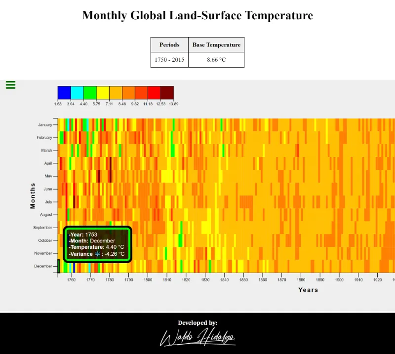
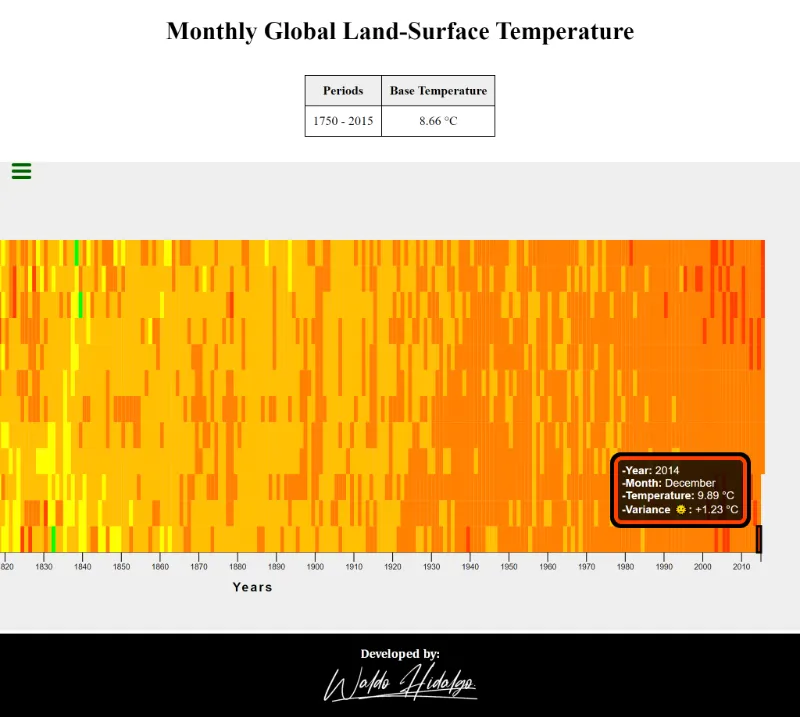

# Visualize Data with a Heat Map

Tercer proyecto: [**Visualize Data with a Heat Map**](https://www.freecodecamp.org/learn/data-visualization/data-visualization-projects/visualize-data-with-a-heat-map) el cual es requisito obligatorio para obtener la **Data Visualization Certification** de freecodecamp.

La data es obtenida desde la siguiente URL: [link a data](https://raw.githubusercontent.com/freeCodeCamp/ProjectReferenceData/master/global-temperature.json)

## Tabla de Contenidos

- [Visualize Data with a Heat Map](#visualize-data-with-a-heat-map)
  - [Tabla de Contenidos](#tabla-de-contenidos)
  - [Requisitos](#requisitos)
  - [All tests passed](#all-tests-passed)
  - [Screenshots](#screenshots)
    - [1. Home](#1-home)
    - [2. Tooltips](#2-tooltips)
      - [2.1. Upper Left Tooltip](#21-upper-left-tooltip)
      - [2.2. Upper Right Tooltip](#22-upper-right-tooltip)
      - [2.3. Bottom Left Tooltip](#23-bottom-left-tooltip)
      - [2.4. Bottom Right Tooltip](#24-bottom-right-tooltip)

## Requisitos

## All tests passed

## Screenshots

### 1. Home

### 2. Tooltips

Todos los tooltips se muestran dentro del gráfico:

#### 2.1. Upper Left Tooltip

#### 2.2. Upper Right Tooltip

#### 2.3. Bottom Left Tooltip

#### 2.4. Bottom Right Tooltip

